# XBrainApp

# AI-Based Brain Cancer Detection Mobile Application 🧠📱

**Description:**

This project focuses on the development of a mobile application designed to assist healthcare professionals in the early and accurate detection of brain cancer using advanced machine learning techniques.

**Objectives:**
- Enable quick and accurate brain cancer diagnosis to improve patient outcomes. 🩺
- Provide a user-friendly interface accessible to healthcare professionals with minimal training. 👩‍⚕️👨‍⚕️
- Maintain comprehensive records of all scans and diagnoses to facilitate better patient management and follow-up. 📋

**Technologies Used:**
- **Frontend:** Flutter framework for cross-platform mobile application development. 🚀
- **Backend:** Flask framework for building the server-side logic and APIs. 🖥️
- **Containerization:** Docker for creating scalable and efficient deployment environments. 🐳
- **Machine Learning:** TensorFlow for building and training the AI model. 🤖
- **Data Source:** Kaggle dataset for training the model, achieving a 97.7% accuracy rate. 📊

**Key Features:**
- **AI Model:** A sophisticated model capable of classifying 15 different types of brain tumors, including Astrocytoma, Glioblastoma, and Meningioma. 🧬
- **User Interface:** Intuitive and easy-to-use interface designed to streamline the diagnostic process. 📱
- **Rapid Diagnosis:** Provides quick and reliable predictions, significantly reducing the time required for diagnosis. ⏱️
- **Detailed Records:** Maintains thorough records of previous scans and diagnoses for improved patient management. 📂

**Impact:**
This project demonstrates the significant potential of AI in medical diagnostics, aiming to save lives by enabling earlier detection and treatment of brain cancer, thereby reducing the burden on healthcare systems. 🌟

**Skills:**
- AI & Machine Learning
- Mobile Application Development
- Cross-Platform Development
- Backend Development
- Containerization
- Data Analysis

**Screenshots:**
**Screenshots:**
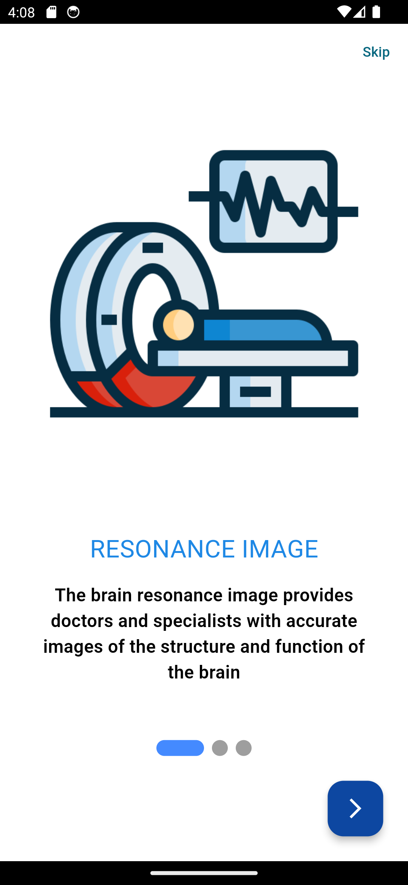
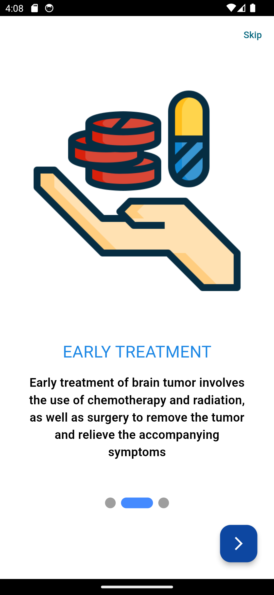
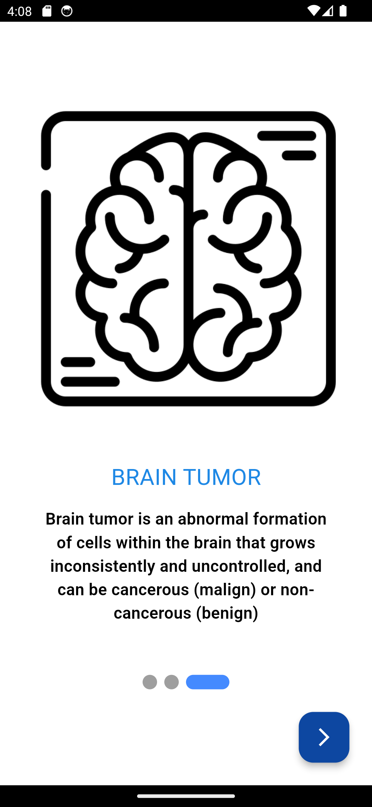
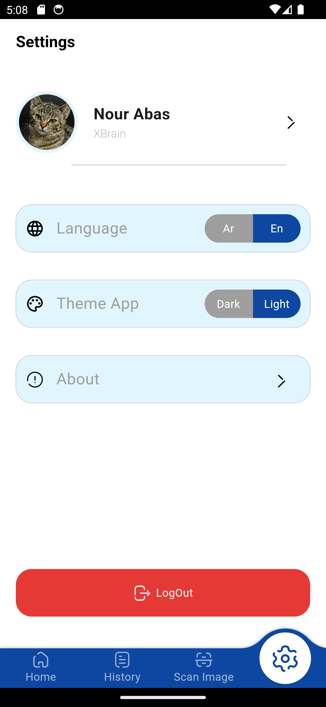

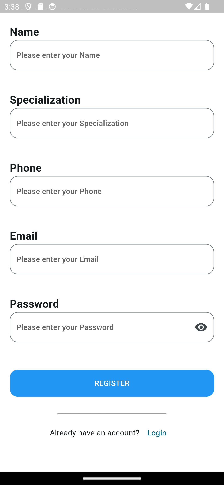

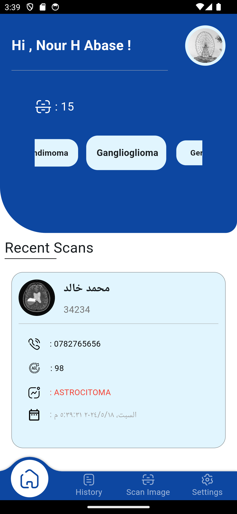
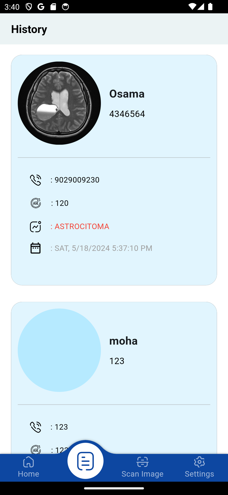
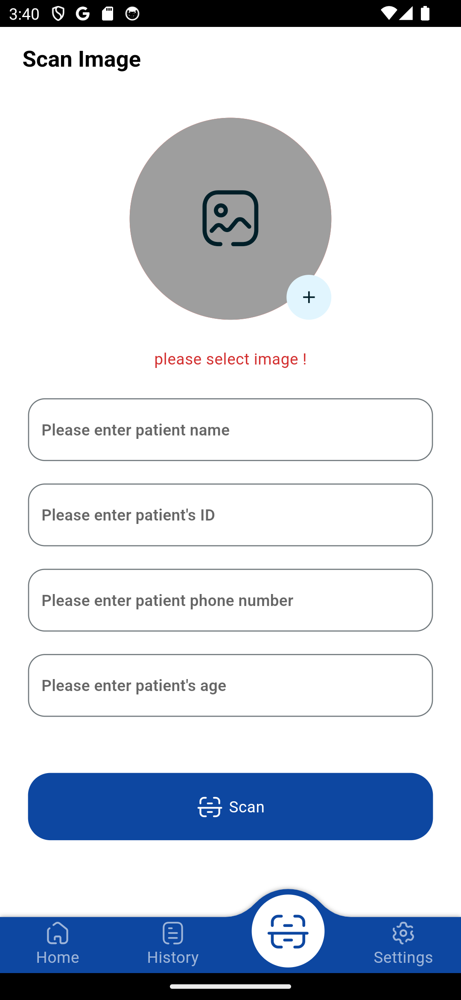
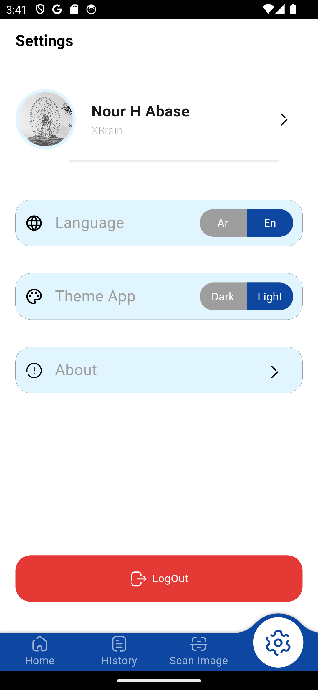
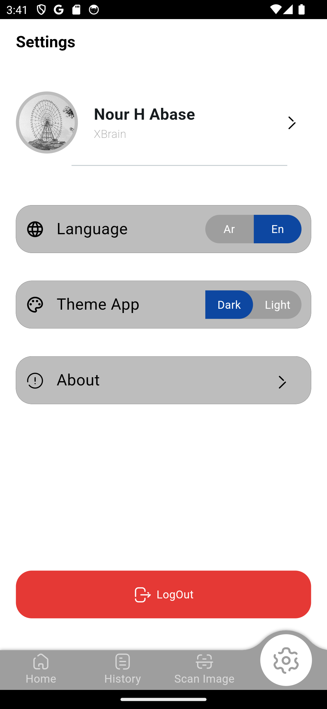
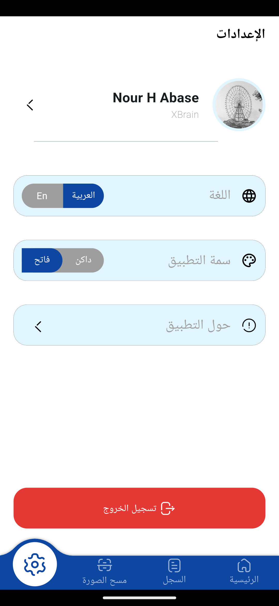
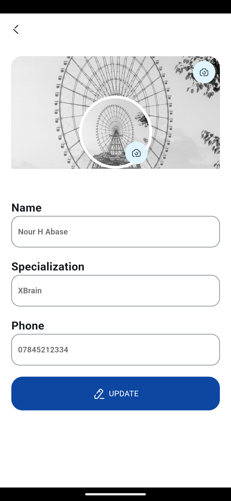
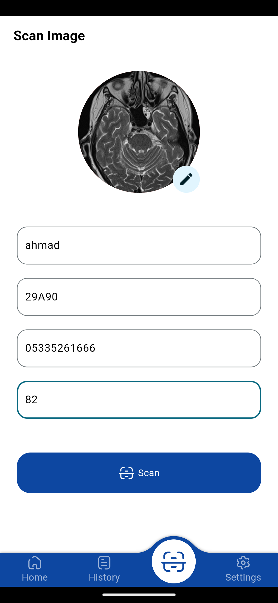
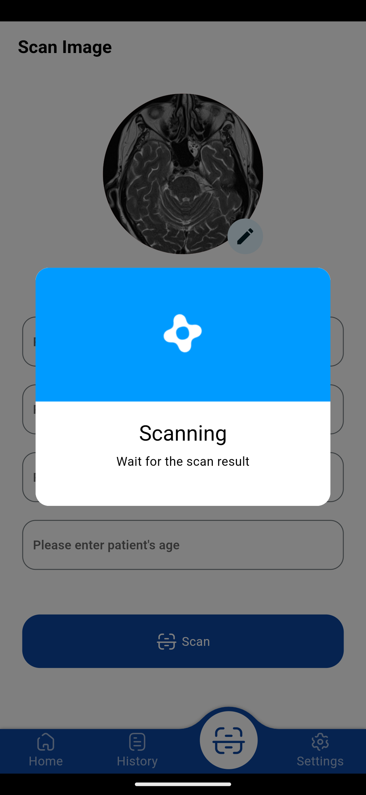

#AI #MachineLearning #Healthcare #BrainCancer #MedicalTechnology #Flutter #Flask #Docker #GraduationProject

